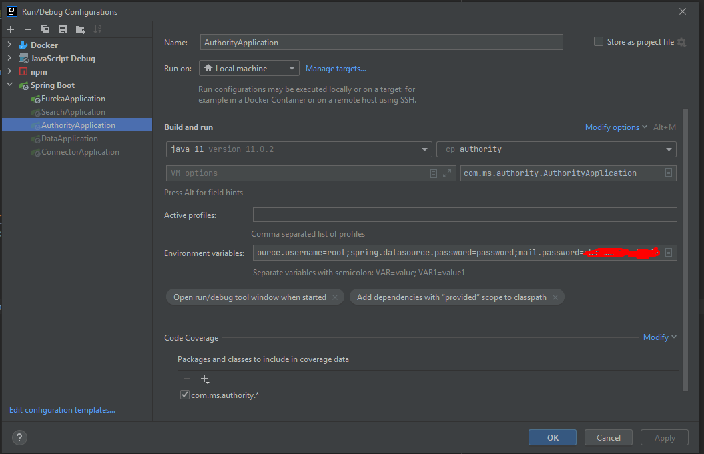

> ### Installation guide:
>1. Download MySQL 8.0.26 from https://dev.mysql.com/downloads/installer/
>2. Install MySQL and create user with admin privileges
>3. Add environment variables: 
>**spring.datasource.username=<YOUR_USERNAME>;** 
>**spring.datasource.password=<YOUR_PASSWORD>;** 
>4. Run AuthorityApplication.
 
>### Change email api key in Run/Debug Configurations:
> 1.Choose AuthorityApplication in left bar  
> 2.In line **"Environment variables"** add **"mail.password=somepasswordhere"** 
> 3.You must now the password ! 
>

> ### WARNING
> DO NOT CHANGE FILES UNDER **/resources/db/migration** DIRECTORY AS IT WILL CHANGE MIGRATIONS CHECKSUM