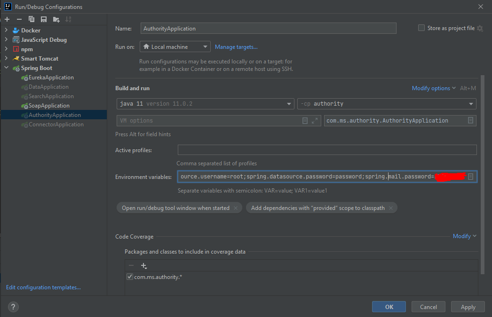

> ### Installation guide:
>1. Download MySQL 8.0.26 from https://dev.mysql.com/downloads/installer/
>2. Install MySQL and create user with admin privileges
>3. Add environment variables: 
>**spring.datasource.username=<YOUR_USERNAME>;** 
>**spring.datasource.password=<YOUR_PASSWORD>;** 
>4. Run AuthorityApplication.
 
>### Change email api key in Run/Debug Configurations:
> 1.Choose AuthorityApplication in left bar  
> 2.In line **"Environment variables"** add **"spring.mail.password=somepasswordhere"** 
> 3.You must now the password ! 
>

> ### WARNING
> DO NOT CHANGE FILES UNDER **/resources/db/migration** DIRECTORY AS IT WILL CHANGE MIGRATIONS CHECKSUM

### Test users
All users have password: `pass`

**Main users:**
* user@gmail.com
* admin_u@gmail.com
* admin_s@gmail.com

**Other users:**
1. Simple user
   * alehandro@gmail.com
   * remi@gmail.com
   * mari@gmail.com
   * alex@gmail.com
   * totoro@gmail.com
   * parker@gmail.com
   * murad@gmail.com
   * zoe@gmail.com
   * robert@gmail.com
   * luisa@gmail.com
2. Admin user
   * pavel@gmail.com
   * richard@gmail.com
   * mali@gmail.com
   * sem@gmail.com
   * wendy@gmail.com
   * un@gmail.com
   * du@gmail.com
   * lee@gmail.com
   * peter@gmail.com
   * kailey@gmail.com
3. Admin schema
   * brain@gmail.com
   * alexa@gmail.com
   * ken@gmail.com
   * alex2@gmail.com
   * britney@gmail.com
   * loki@gmail.com
   * steve@gmail.com
   * black@gmail.com
   * thor@gmail.com   
   * steven@gmail.com