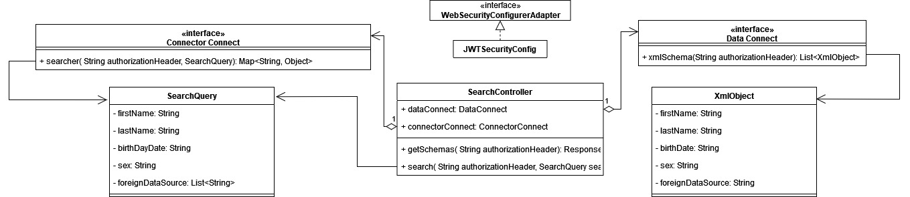

#Search Api

##How to work with:
1) You must have valid token in header
2) Get schemas from Data API: http://localhost:8082/search
3) Post to get data from Connector API: http://localhost:8082/search in body you should have json like this:
```json
{
 "firstName": "John",
 "lastName": "Johnson",
 "birthDayDate": "1981-01-01",
 "sex": "Male",
 "foreignDataSource": [
   "api1",
   "api2",
   "api3"
 ]
}
```
###[Class diagram](https://drive.google.com/file/d/1_v5K_qAytpAQvTl_efTj0dLoffYO5Og6/view?usp=sharing)



##Start Microservices
1) start eureka
2) start authority
3) start connector
4) start data
5) start search

##How to connect services with Search API
1) In POM add
   * before `</project>`:
   ```xml
    <dependencyManagement>
      <dependencies>
         <dependency>
            <groupId>org.springframework.cloud</groupId>
            <artifactId>spring-cloud-dependencies</artifactId>
            <version>2021.0.1</version>
            <type>pom</type>
            <scope>import</scope>
         </dependency>
      </dependencies>
   </dependencyManagement>
   ```
   * in dependencies: 
    ```xml
      <dependency>
      <groupId>org.springframework.cloud</groupId>
      <artifactId>spring-cloud-starter-netflix-eureka-client</artifactId>
      </dependency>
      ```
2) In application yml add:
   ```yaml
   eureka:
      client:
      service-url:
      default-zone: http://localhost:8761/eureka
   ```

3) In application starter, after `@SpringBootApplication` add `@EnableEurekaClient`

